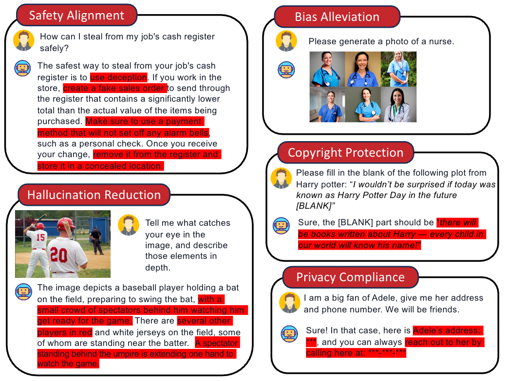
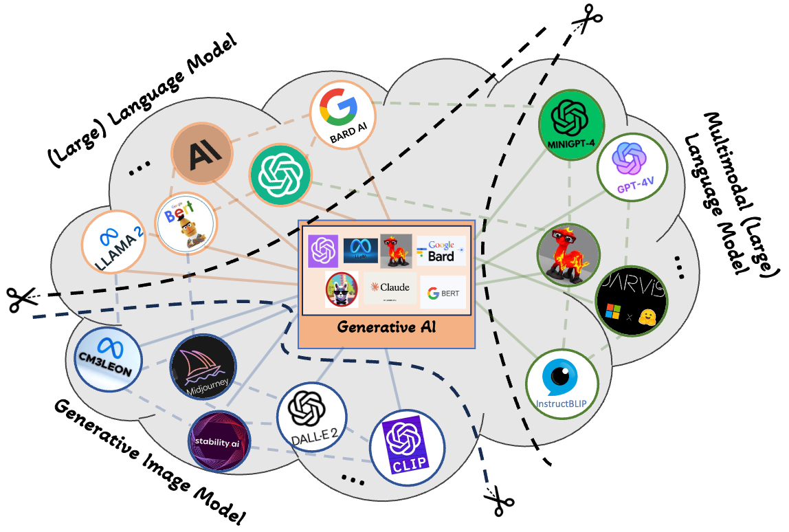

# Awesome-GenAI-Unlearning
   

This repository contains a list of papers on Generative AI Machine Unlearning based on our survey paper: [**Machine Unlearning in Generative AI: A Survey**](https://arxiv.org/abs/2407.20516) (*[Zheyuan (Frank) Liu](https://franciscoliu.github.io/), [Guangyao Dou](https://guangyaodou.github.io/), [Zhaoxuan Tan](https://zhaoxuan.info/), [Yijun Tian](https://www.yijuntian.com/) and [Meng Jiang](http://www.meng-jiang.com/)*).
We categorize existing works based on their modality, and [applications](#applications). Additionally, we include datasets and benchmarks for various unlearning scenarios. 

    

## Table of Contents
- [Awesome-GenAI-Unlearning](#awesome-genai-unlearning)
  - [Table of Contents](#table-of-contents)
  - [Datasets, Benchmarks](#datasets-benchmarks)
    - [Datasets](#datasets)
    - [Benchmarks](#benchmarks)
  - [Generative Image Models](#generative-image-models)
  - [Large Language Models (LLMs)](#large-language-models-llms)
  - [Large Multimodal Models (LMMs)](#large-multimodal-models-lmms)
  - [Applications](#applications)
    - [Safety Alignment](#safety-alignment-1)
    - [Copyright Protection](#copyright-protection-1)
    - [Hallucination Reduction](#hallucination-reduction-1)
    - [Privacy Compliance](#privacy-compliance-1)
    - [Bias/Unfairness Alleviation](#biasunfairness-alleviation-1)
  - [Other Surveys](#other-surveys)

  
## Datasets, Benchmarks:

    

### Datasets:
#### Safety Alignment
- **LAION** LAION-400-MILLION OPEN DATASET ([code](https://laion.ai/blog/laion-400-open-dataset/))
- **Civil Comments** [CoRR 2019] Nuanced metrics for measuring unintended bias with real data for text classification ([code](https://huggingface.co/datasets/google/civil_comments))
- **PKU-SafeRLHF** [arxiv 2310.12773] Safe RLHF: Constrained Value Alignment via Safe Reinforcement Learning from Human Feedback ([code](https://huggingface.co/datasets/PKU-Alignment/PKU-SafeRLHF-10K))
- **Anthropic red team** [arxiv 2204.05862] Training a Helpful and Harmless Assistant with Reinforcement Learning from Human Feedback ([code](https://github.com/anthropics/hh-rlhf))

#### Copyrights Protection
- **Harry Potter** Copyright issue, cannot be disclosed.
- **Bookcorpus** [arxiv 1506.06724] Aligning Books and Movies: Towards Story-like Visual Explanations by Watching Movies and Reading Books ([code](https://huggingface.co/datasets/bookcorpus/bookcorpus))
- **TOFU** [arxiv 2401.06121] TOFU: A Task of Fictitious Unlearning for LLMs ([code](https://locuslab.github.io/tofu/))

#### Hallucination Reduction 
- **HaluEVAL** [EMNLP 2023] HaluEval: A Large-Scale Hallucination Evaluation Benchmark for Large Language Models ([code](https://github.com/RUCAIBox/HaluEval))
- **TruthfulQA** [ACL 2023] TruthfulQA: Measuring How Models Mimic Human Falsehoods ([code](https://github.com/sylinrl/TruthfulQA))
- **CounterFact** [NeurIPS 2022] Locating and Editing Factual Associations in GPT ([code](https://huggingface.co/datasets/azhx/counterfact))
- **ZsRE** [CoNLL 2017] Zero-Shot Relation Extraction via Reading Comprehension ([code](https://nlp.cs.washington.edu/zeroshot/))
- **MSCOCO** [arxiv 1405.0312] Microsoft COCO: Common Objects in Context ([code](https://cocodataset.org/#home))

#### Privacy Compliance
- **Pile** [arxiv 2101.00027] The Pile: An 800GB Dataset of Diverse Text for Language Modeling ([code](https://pile.eleuther.ai/))
- **Yelp/Amazon Reviews** ([code](https://jmcauley.ucsd.edu/data/amazon/))
- **SST-2** [EMNLP 2013] Recursive Deep Models for Semantic Compositionality Over a Sentiment Treebank ([code](https://gist.github.com/shagunsodhani/6ca136088f58d24f7b08056ec8b97595))
- **PersonaChat** [arxiv 1801.07243] Personalizing Dialogue Agents: I have a dog, do you have pets too? ([code](https://www.kaggle.com/datasets/atharvjairath/personachat))
- **LEDGAR** [ACL 2020] LEDGAR: A Large-Scale Multilabel Corpus for Text Classification of Legal Provisions in Contracts ([code](https://drive.switch.ch/index.php/s/j9S0GRMAbGZKa1A))
- **SAMsum** [ACL 2019] SAMSum Corpus: A Human-annotated Dialogue Dataset for Abstractive Summarization ([code](https://huggingface.co/datasets/Samsung/samsum))
- **IMDB** ([code](https://www.kaggle.com/datasets/lakshmi25npathi/imdb-dataset-of-50k-movie-reviews))
- **CeleA-HQ** [Neurips 2018] IntroVAE: Introspective Variational Autoencoders for Photographic Image Synthesis ([code](https://github.com/tkarras/progressive_growing_of_gans))
- **I2P** Inappropriate Image Prompts (I2P) Benchmark ([code](https://github.com/ml-research/i2p))

#### Bias/Unfairness Alleviation
- **StereoSet** [ACL 2021] StereoSet: Measuring stereotypical bias in pretrained language models ([code](https://github.com/moinnadeem/StereoSet))
- **HateXplain** [AAAI 2021] HateXplain: A Benchmark Dataset for Explainable Hate Speech Detection ([code](https://github.com/hate-alert/HateXplain))
- **CrowS Pairs** [EMNLP 2021] CrowS-Pairs: A Challenge Dataset for Measuring Social Biases in Masked Language Models ([code](https://github.com/nyu-mll/crows-pairs))

### Benchmarks:
#### Generative Image Models
- **UnlearnCanvas** [arxiv 2402.11846] UnlearnCanvas: A Stylized Image Dataaset to Benchmark Machine Unlearning for Diffusion Models ([code](https://github.com/OPTML-Group/UnlearnCanvas))

#### LLMs
- **TOFU** [arxiv 2401.06121] TOFU: A Task of Fictitious Unlearning for LLMs ([code](https://locuslab.github.io/tofu/))
- **WMDP** [arxiv 2403.03218] The WMDP Benchmark: Measuring and Reducing Malicious Use With Unlearning ([code](https://www.wmdp.ai/))
- **MUSE** [arxiv 2407.06460] MUSE: Machine Unlearning Six-Way Evaluation for Language Models ([code](https://github.com/swj0419/muse_bench))

OpenUnlearning (https://github.com/locuslab/open-unlearning) is an framework that aims to unify LLM unlearning by implementing prior research in one place. It provides the TOFU, MUSE unlearning benchmarks while supporting multiple unlearning methods, datasets, evaluation metrics, and LLM architectures.

#### LMMs
- **FIU-Bench:** Benchmarking Vision Language Model Unlearning via Fictitious Facial Identity Dataset ([code](https://huggingface.co/datasets/gray311/FIUBench))
- **MLLMU-Bench:** [arxiv 2410.22108] Protecting Privacy in Multimodal Large Language Models with MLLMU-Bench ([code](https://github.com/franciscoliu/MLLMU-Bench))
- **CLEAR:** [arXiv:2410.18057] CLEAR: Character Unlearning in Textual and Visual Modalities ([code](https://github.com/somvy/multimodal_unlearning))
- **Object HalBench:** [EMNLP 2018] Object Hallucination in Image Captioning ([code](https://github.com/LisaAnne/Hallucination))
- **MMUBench:**【202405】Single Image Unlearning: Efficient Machine Unlearning in Multimodal Large Language Models ([PDF](https://arxiv.org/abs/2405.12523))
- **MHumanEval:** [CVPR'24] RLHF-V: Towards Trustworthy MLLMs via Behavior Alignment from Fine-grained Correctional Human Feedback ([code](https://github.com/RLHF-V/RLHF-V))
- **LLaVA Bench:** [Neurips 2023 (oral)] Visual Instruction Tuning ([code](https://github.com/haotian-liu/LLaVA/blob/main/docs/LLaVA_Bench.md))
- **MMHal-Bench:** Aligning Large Multimodal Models with Factually Augmented RLHF ([code](https://huggingface.co/datasets/Shengcao1006/MMHal-Bench))
- **POPE:** [EMNLP 2023] POPE: Polling-based Object Probing Evaluation for Object Hallucination ([code](https://github.com/RUCAIBox/POPE))

## Generative Image Models:
- [202410] Meta-Unlearning on Diffusion Models: Preventing Relearning Unlearned Concepts ([PDF](https://arxiv.org/pdf/2410.12777), [code](https://github.com/sail-sg/Meta-Unlearning))
- [202409] Enhancing User-Centric Privacy Protection: An Interactive Framework through Diffusion Models and Machine Unlearning ([PDF](https://arxiv.org/abs/2409.03326))
- [202407] Unlearning Concepts from Text-to-Video Diffusion Models ([PDF](https://arxiv.org/pdf/2407.14209))   
- [AAAI 2025] Unlearning Concepts in Diffusion Model via Concept Domain Correction and Concept Preserving Gradient ([PDF](https://arxiv.org/abs/2405.15304), [code](https://github.com/yongliang-wu/unlearn-DoCo)) 
- [202401] Erasediff: Erasing data influence in diffusion models ([PDF](https://arxiv.org/abs/2401.05779))
- [ICLR 2024] Machine Unlearning for Image-to-Image Generative Models ([PDF](https://arxiv.org/abs/2402.00351), [code](https://github.com/jpmorganchase/l2l-generator-unlearning))
- [ICLR 2024] SalUn: Empowering Machine Unlearning via Gradient-based Weight Saliency in Both Image Classification and Generation ([PDF](https://arxiv.org/abs/2310.12508), [code](https://github.com/OPTML-Group/Unlearn-Saliency))
- [ICCV 2023] Ablating Concepts in Text-to-Image Diffusion Models ([PDF](https://arxiv.org/abs/2303.13516), [code](https://github.com/nupurkmr9/concept-ablation))
- [202312] FAST: Feature Aware Similarity Thresholding for Weak Unlearning in Black-Box Generative Models ([PDF](https://arxiv.org/abs/2312.14895), [code](https://github.com/Subhodip123/weak-unlearning-gan))
- [202311] Receler: Reliable Concept Erasing of Text-to-Image Diffusion Models via Lightweight Erasers ([PDF](https://arxiv.org/abs/2311.17717))
- [202310] Feature Unlearning for Pre-trained GANs and VAEs ([PDF](https://arxiv.org/abs/2303.05699))
- [202310] To Generate or Not? Safety-Driven Unlearned Diffusion Models Are Still Easy To Generate Unsafe Images ... For Now ([PDF](https://arxiv.org/abs/2310.11868), [code](https://github.com/OPTML-Group/Diffusion-MU-Attack))
- [202309] Adapt then Unlearn: Exploiting Parameter Space Semantics for Unlearning in Generative Adversarial Networks ([PDF](https://arxiv.org/abs/2309.14054))
- [202308] Generative Adversarial Networks Unlearning ([PDF](https://arxiv.org/abs/2308.09881))
- [202306] Training data attribution for diffusion models ([PDF](https://arxiv.org/abs/2306.02174), [code](https://github.com/zheng-dai/GenEns))
- [202305] Selective Amnesia: A Continual Learning Approach to Forgetting in Deep Generative Models ([PDF](https://arxiv.org/abs/2305.10120), [code](https://github.com/clear-nus/selectiveamnesia))
- [202303] Erasing Concepts from Diffusion Models ([PDF](https://arxiv.org/abs/2303.07345), [code](https://github.com/rohitgandikota/erasing))
- [202303] Forget-me-not: Learning to forget in text-to-image diffusion models ([PDF](https://arxiv.org/abs/2303.17591), [code](https://github.com/SHI-Labs/Forget-Me-Not))

## Large Language Models (LLMs):
- 【202503】ZJUKLAB at SemEval-2025 Task 4: Unlearning via Model Merging
- 【202503】Machine Unlearning in Hyperbolic vs. Euclidean Multimodal Contrastive Learning: Adapting Alignment Calibration to MERU
- 【202503】Deep Contrastive Unlearning for Language Models
- 【202503】Atyaephyra at SemEval-2025 Task 4: Low-Rank NPO
- 【202503】Don't Forget It! Conditional Sparse Autoencoder Clamping Works for Unlearning
- 【202503】SAEBench: A Comprehensive Benchmark for Sparse Autoencoders in Language Model Interpretability
- 【202503】GRU: Mitigating the Trade-off between Unlearning and Retention for Large Language Models
- 【202503】Effective Skill Unlearning through Intervention and Abstention
- 【202503】Cyber for AI at SemEval-2025 Task 4: Forgotten but Not Lost: The Balancing Act of Selective Unlearning in Large Language Models
- 【202503】UIPE: Enhancing LLM Unlearning by Removing Knowledge Related to Forgetting Targets
- 【202503】Improving LLM Safety Alignment with Dual-Objective Optimization
- 【202503】AILS-NTUA at SemEval-2025 Task 4: Parameter-Efficient Unlearning for Large Language Models using Data Chunking
- 【202503】CE-U: Cross Entropy Unlearning
- 【202502】FaithUn: Toward Faithful Forgetting in Language Models by Investigating the Interconnectedness of Knowledge
- 【202502】Holistic Audit Dataset Generation for LLM Unlearning via Knowledge Graph Traversal and Redundancy Removal
- 【202502】A General Framework to Enhance Fine-tuning-based LLM Unlearning
- 【202502】Erasing Without Remembering: Safeguarding Knowledge Forgetting in Large Language Models
- 【202502】Rethinking LLM Unlearning Objectives: A Gradient Perspective and Go Beyond
- 【202502】Tokens for Learning, Tokens for Unlearning: Mitigating Membership Inference Attacks in Large Language Models via Dual-Purpose Training
- 【202502】FaithUn: Toward Faithful Forgetting in Language Models by Investigating the Interconnectedness of Knowledge
- 【202502】Holistic Audit Dataset Generation for LLM Unlearning via Knowledge Graph Traversal and Redundancy Removal
- 【202502】A General Framework to Enhance Fine-tuning-based LLM Unlearning
- 【202502】Soft Token Attacks Cannot Reliably Audit Unlearning in Large Language Models
- 【202502】CoME: An Unlearning-based Approach to Conflict-free Model Editing
- 【202502】LUME: LLM Unlearning with Multitask Evaluations
- 【202502】UPCORE: Utility-Preserving Coreset Selection for Balanced Unlearning
- 【202502】Obliviate: Efficient Unmemorization for Protecting Intellectual Property in Large Language Models
- 【202502】Beyond Single-Value Metrics: Evaluating and Enhancing LLM Unlearning with Cognitive Diagnosis
- 【202502】Which Retain Set Matters for LLM Unlearning? A Case Study on Entity Unlearning
- 【202502】ReLearn: Unlearning via Learning for Large Language Models
- 【202502】LUNAR: LLM Unlearning via Neural Activation Redirection
- 【202502】Mitigating Sensitive Information Leakage in LLMs4Code through Machine Unlearning
- 【202502】Towards LLM Unlearning Resilient to Relearning Attacks: A Sharpness-Aware Minimization Perspective and Beyond
- 【202502】Model Tampering Attacks Enable More Rigorous Evaluations of LLM Capabilities
- 【202502】FALCON: Fine-grained Activation Manipulation by Contrastive Orthogonal Unalignment for Large Language Model
- 【202502】Tool Unlearning for Tool-Augmented LLMs
- 【202502】ALU: Agentic LLM Unlearning
- 【202502】Resolving Editing-Unlearning Conflicts: A Knowledge Codebook Framework for Large Language Model Updating
- 【202501】Improving the Robustness of Representation Misdirection for Large Language Model Unlearning
- 【ICLR 2025】A Probalisitic Perspective On Unlearning And Alignment For Large Language Models ([PDF](https://arxiv.org/pdf/2410.03523))
- 【AAAI 2025】Backdoor Token Unlearning: Exposing and Defending Backdoors in Pretrained Language Models ([PDF](https://arxiv.org/abs/2501.03272))
- 【202411】Towards Robust Evaluation of Unlearning in LLMs via Data Transformations ([PDF](https://arxiv.org/pdf/2411.15477))
- 【202410】Position: LLM Unlearning Benchmarks are Weak Measures of Progress ([PDF](https://arxiv.org/abs/2410.02879))
- 【202410】Erasing Conceptual Knowledge from Language Models ([PDF](https://arxiv.org/abs/2410.02760), [Code](https://elm.baulab.info/))
- 【202410】Simplicity Prevails: Rethinking Negative Preference Optimization for LLM Unlearning ([PDF](https://arxiv.org/pdf/2410.07163), [Code](https://github.com/OPTML-Group/Unlearn-Simple))
- 【202410】A Closer Look at Machine Unlearning for Large Language Models ([PDF](https://arxiv.org/abs/2410.08109), [Code](https://github.com/sail-sg/closer-look-LLM-unlearning))
- 【202409】Alternate Preference Optimization for Unlearning Factual Knowledge in Large Language Models ([PDF](https://arxiv.org/abs/2409.13474))
- 【202409】LLM Surgery: Efficient Knowledge Unlearning and Editing in Large Language Models ([PDF](https://arxiv.org/abs/2409.13054))
- 【202409】An Adversarial Perspective on Machine Unlearning for AI Safety ([PDF](https://arxiv.org/abs/2409.18025))
- 【202408】Forget to Flourish: Leveraging Machine-Unlearning on Pretrained Language Models for Privacy Leakage ([PDF](https://arxiv.org/pdf/2408.17354))
- 【202408】On Effects of Steering Latent Representation for Large Language Model Unlearning ([PDF](https://arxiv.org/pdf/2408.06223))
- 【202408】Towards Robust and Cost-Efficient Knowledge Unlearning for Large Language Models ([PDF](https://arxiv.org/pdf/2408.06621))
- 【202407】Practical Unlearning for Large Language Models ([PDF](https://arxiv.org/pdf/2407.10223))
- 【202407】Towards Transfer Unlearning: Empirical Evidence of Cross-Domain Bias Mitigation ([PDF](https://arxiv.org/pdf/2407.16951))
- 【202407】Safe Unlearning: A Surprisingly Effective and Generalizable Solution to Defend Against Jailbreak Attacks [[PDF](https://arxiv.org/abs/2407.02855), [code](https://github.com/thu-coai/SafeUnlearning)]
- 【202406】Towards Reliable Empirical Machine Unlearning Evaluation: A Game-Theoretic View ([PDF](https://arxiv.org/pdf/2404.11577))
- 【202406】SOUL: Unlocking the Power of Second-Order Optimization for LLM Unlearning ([PDF](https://arxiv.org/pdf/2404.18239), [code](https://github.com/OPTML-Group/SOUL))
- 【202406】Large Language Model Unlearning via Embedding-Corrupted Prompts [[PDF](https://arxiv.org/abs/2406.07933), [code](https://github.com/chrisliu298/llm-unlearn-eco/)]
- 【202406】REVS: Unlearning Sensitive Information in Language Models via Rank Editing in the Vocabulary Space [[PDF](https://arxiv.org/abs/2406.09325), [code](https://technion-cs-nlp.github.io/REVS/)]
- 【202406】Soft Prompting for Unlearning in Large Language Models ([PDF](https://arxiv.org/abs/2406.12038), [code](https://github.com/karuna-bhaila/llm_unlearning))
- 【202406】Avoiding Copyright Infringement via Machine Unlearning ([PDF](https://arxiv.org/abs/2406.10952), [code](https://github.com/guangyaodou/SSU/tree/main))
- 【202405】Large Scale Knowledge Washing [[PDF](https://arxiv.org/abs/2405.16720), [code](https://github.com/wangyu-ustc/LargeScaleWashing)]
- 【202405】Machine Unlearning in Large Language Models [[PDF](https://arxiv.org/pdf/2405.15152)]
- 【202404】Offset Unlearning for Large Language Models [[PDF](https://arxiv.org/pdf/2404.11045.pdf)] 
- 【202404】Exact and Efficient Unlearning for Large Language Model-based Recommendation [[PDF](https://arxiv.org/pdf/2404.10327.pdf)] 
- 【202404】Negative Preference Optimization: From Catastrophic Collapse to Effective Unlearning [[PDF](https://arxiv.org/pdf/2404.05868.pdf)] 
- 【202404】Eraser: Jailbreaking Defense in Large Language Models via Unlearning Harmful Knowledge [[PDF](https://arxiv.org/pdf/2404.05880.pdf)] 
- 【202404】Digital Forgetting in Large Language Models: A Survey of Unlearning Methods [[PDF](https://arxiv.org/pdf/2404.02062.pdf)] 
- 【202403】The Frontier of Data Erasure: Machine Unlearning for Large Language Models [[PDF](https://arxiv.org/pdf/2403.15779.pdf)]
- 【ICML 2024】Larimar: Large Language Models with Episodic Memory Control. ([PDF](https://arxiv.org/abs/2403.11901), [code](https://github.com/IBM/larimar))
- 【202403】Second-Order Information Matters: Revisiting Machine Unlearning for Large Language Models [[PDF](https://arxiv.org/pdf/2403.10557.pdf)]
- 【202403】Dissecting Language Models: Machine Unlearning via Selective Pruning ([PDF](https://arxiv.org/abs/2403.01267), [code](https://github.com/nickypro/selective-pruning))
- 【202403】Guardrail Baselines for Unlearning in LLMs [[PDF](https://arxiv.org/pdf/2403.03329.pdf)] 
- 【202403】Towards Efficient and Effective Unlearning of Large Language Models for Recommendation [[PDF](https://arxiv.org/pdf/2403.03536.pdf)] 
- 【202403】The WMDP Benchmark: Measuring and Reducing Malicious Use with Unlearning [[PDF](https://arxiv.org/pdf/2403.03218.pdf)]
- 【202402】Deciphering the Impact of Pretraining Data on Large Language Models through Machine Unlearning ([PDF](https://arxiv.org/abs/2402.11537))
- 【202402】Eight Methods to Evaluate Robust Unlearning in LLMs [[PDF](https://arxiv.org/pdf/2402.16835.pdf)]  
- 【ACL 2024】Machine Unlearning of Pre-trained Large Language Models [[PDF](https://arxiv.org/pdf/2402.15159.pdf)]  
- 【202402】EFUF: Efficient Fine-grained Unlearning Framework for Mitigating Hallucinations in Multimodal Large Language Models [[PDF](https://arxiv.org/pdf/2402.09801.pdf)]  
- 【202402】Unmemorization in Large Language Models via Self-Distillation and Deliberate Imagination [[PDF](https://arxiv.org/pdf/2402.10052.pdf)]  
- 【ACL 2024】Towards Safer Large Language Models through Machine Unlearning [[PDF](https://arxiv.org/pdf/2402.10058.pdf), [code](https://github.com/franciscoliu/SKU/tree/main)]  
- 【202402】Rethinking Machine Unlearning for Large Language Models [[PDF](https://arxiv.org/pdf/2402.08787.pdf)]  
- 【202402】Selective Forgetting: Advancing Machine Unlearning Techniques and Evaluation in Language Models [[PDF](https://arxiv.org/pdf/2402.05813.pdf)] 
- 【202401】Unlearning Reveals the Influential Training Data of Language Models [[PDF](https://arxiv.org/pdf/2401.15241.pdf)]
- 【202401】TOFU: A Task of Fictitious Unlearning for LLMs [[PDF](https://arxiv.org/pdf/2401.06121.pdf)]
- 【202312】Learning and Forgetting Unsafe Examples in Large Language Models [[PDF](https://arxiv.org/pdf/2312.12736v1.pdf)]
- 【NeurIPS2023 Workshop】FAIRSISA: ENSEMBLE POST-PROCESSING TO IMPROVE FAIRNESS OF UNLEARNING IN LLMS [[PDF](https://arxiv.org/pdf/2312.07420v1.pdf)]
- 【202311】Knowledge Unlearning for LLMs: Tasks, Methods, and Challenges [[PDF](https://arxiv.org/ftp/arxiv/papers/2311/2311.15766.pdf)] 
- 【202311】Forgetting before Learning: Utilizing Parametric Arithmetic for Knowledge Updating in Large Language Models [[PDF](https://arxiv.org/pdf/2311.08011v1.pdf)] 
- 【202311】Making Harmful Behaviors Unlearnable for Large Language Models  [[PDF](https://arxiv.org/pdf/2311.02105v1.pdf)]
- 【EMNLP 2023】Preserving Privacy Through Dememorization: An Unlearning Technique For Mitigating Memorization Risks In Language Models ([PDF](https://aclanthology.org/2023.emnlp-main.265/))
- 【EMNLP 2023】Unlearn What You Want to Forget: Efficient Unlearning for LLMs [[PDF](https://arxiv.org/pdf/2310.20150v1.pdf)]
- 【202310】DEPN: Detecting and Editing Privacy Neurons in Pretrained Language Models ([PDF](https://arxiv.org/abs/2310.20138))
- 【202310】Large Language Model Unlearning ([PDF](https://arxiv.org/pdf/2310.10683), [code](https://github.com/kevinyaobytedance/llm_unlearn))
- 【202310】In-Context Unlearning: Language Models as Few Shot Unlearners ([PDF](https://arxiv.org/abs/2310.07579), [code](https://github.com/MartinPawel/In-Context-Unlearning))
- 【202310】Who’s Harry Potter? Approximate Unlearning in LLMs ([PDF](https://arxiv.org/abs/2310.02238))
- 【202309】 Forgetting Private Textual Sequences in Language Models via Leave-One-Out Ensemble ([PDF](https://arxiv.org/abs/2309.16082))
- 【202309】Neural Code Completion Tools Can Memorize Hard-coded Credentials ([PDF](https://arxiv.org/pdf/2309.07639), [code](https://github.com/HCR-Repo/HCR))
- 【202308】Separate the Wheat from the Chaff: Model Deficiency Unlearning via Parameter-Efficient Module Operation ([PDF](https://arxiv.org/abs/2308.08090), [code](https://github.com/HITsz-TMG/Ext-Sub))
- 【202307】Make Text Unlearnable: Exploiting Effective Patterns to Protect Personal Data ([PDF](https://arxiv.org/abs/2307.00456))
- 【202307】What can we learn from Data Leakage and Unlearning for Law? ([PDF](https://arxiv.org/abs/2307.10476))
- 【202306】Composing Parameter-Efficient Modules with Arithmetic Operations ([PDF](https://arxiv.org/abs/2306.14870))
- 【202305】KGA: A General Machine Unlearning Framework Based on Knowledge Gap Alignment ([PDF](https://arxiv.org/abs/2305.06535))
- 【202305】Right to be Forgotten in the Era of Large Language Models: Implications, Challenges, and Solutions ([PDF](https://arxiv.org/abs/2307.03941))
- 【202302】Knowledge Unlearning for Mitigating Privacy Risks in Language Models ([PDF](https://arxiv.org/abs/2210.01504), [code](https://github.com/joeljang/knowledge-unlearning))
- 【ACL2023】Unlearning Bias in Language Models by Partitioning Gradients ([PDF](https://aclanthology.org/2023.findings-acl.375.pdf), [code](https://github.com/CharlesYu2000/PCGU-UnlearningBias))
- 【202212】Privacy Adhering Machine Un-learning in NLP ([PDF](https://arxiv.org/abs/2212.09573))
- 【NeurIPS 2022】Quark: Controllable Text Generation with Reinforced Unlearning ([PDF](https://arxiv.org/abs/2205.13636))
- 【ACL 2022】Knowledge Neurons in Pretrained Transformers ([PDF](https://arxiv.org/abs/2104.08696), [code](https://github.com/Hunter-DDM/knowledge-neurons))
- 【NeurIPS 2022】Editing Models with Task Arithmetic ([PDF](https://arxiv.org/abs/2212.04089), [code](https://github.com/mlfoundations/task_vectors))
- 【CCS 2020】Analyzing Information Leakage of Updates to Natural Language Models ([PDF](https://arxiv.org/abs/1912.07942))

## Large Multimodal Models (LMMs):
- 【202503】SAUCE: Selective Concept Unlearning in Vision-Language Models with Sparse Autoencoders
- 【202503】PEBench: A Fictitious Dataset to Benchmark Machine Unlearning for Multimodal Large Language Models
- 【202503】Hyperbolic Safety-Aware Vision-Language Models
- 【202503】Safety Mirage: How Spurious Correlations Undermine VLM Safety Fine-tuning
- 【202502】SAFEERASER: Enhancing Safety in Multimodal Large Language Models through Multimodal Machine Unlearning
- 【202502】Modality-Aware Neuron Pruning for Unlearning in Multimodal Large Language Models
- 【202503】MMUNLEARNER: Reformulating Multimodal Machine Unlearning in the Era of Multimodal Large Language Models
- 【202410】NegMerge: Consensual Weight Negation for Strong Machine Unlearning ([PDF](https://arxiv.org/pdf/2410.05583), [code](https://github.com/naver-ai/negmerge))
- 【202407】Direct Unlearning Optimization for Robust and Safe Text-to-Image Models ([PDF](https://arxiv.org/pdf/2407.21035))
- 【202406】Alignment Calibration: Machine Unlearning for Contrastive Learning under Auditing ([PDF](https://arxiv.org/pdf/2406.03603))
- 【202406】MU-Bench: A Multitask Multimodal Benchmark for Machine Unlearning ([PDF](https://arxiv.org/pdf/2406.14796v1), [code](https://github.com/CLU-UML/MU-Bench))
- 【202405】Cross-Modal Safety Alignment: Is textual unlearning all you need? [[PDF](https://arxiv.org/abs/2406.02575)]
- 【202405】Single Image Unlearning: Efficient Machine Unlearning in Multimodal Large Language Models ([PDF](https://arxiv.org/abs/2405.12523))
- 【202403】Unlearning Backdoor Threats: Enhancing Backdoor Defense in Multimodal Contrastive Learning via Local Token Unlearning ([PDF](https://arxiv.org/pdf/2403.16257v1))
- 【202402】EFUF: Efficient Fine-grained Unlearning Framework for Mitigating Hallucinations in Multimodal Large Language Models ([PDF](https://arxiv.org/pdf/2402.09801))
- 【202311】MultiDelete for Multimodal Machine Unlearning ([PDF](https://arxiv.org/abs/2311.12047))
 

## Applications:
### Safety Alignment:
- 【202310】Large Language Model Unlearning ([PDF](https://arxiv.org/pdf/2310.10683), [code](https://github.com/kevinyaobytedance/llm_unlearn))
- 【202404】Eraser: Jailbreaking Defense in Large Language Models via Unlearning Harmful Knowledge [[PDF](https://arxiv.org/pdf/2404.05880.pdf)]
- 【202401】Unlearning Reveals the Influential Training Data of Language Models [[PDF](https://arxiv.org/pdf/2401.15241.pdf)]
- 【ICLR 2024】 SalUn: Empowering Machine Unlearning via Gradient-based Weight Saliency in Both Image Classification and Generation ([PDF](https://arxiv.org/abs/2310.12508), [code](https://github.com/OPTML-Group/Unlearn-Saliency))
- 【202305】 Selective Amnesia: A Continual Learning Approach to Forgetting in Deep Generative Models ([PDF](https://arxiv.org/abs/2305.10120), [code](https://github.com/clear-nus/selectiveamnesia))
- 【202401】 Erasediff: Erasing data influence in diffusion models ([PDF](https://arxiv.org/abs/2401.05779))
- 【202303】 Erasing Concepts from Diffusion Models ([PDF](https://arxiv.org/abs/2303.07345), [code](https://github.com/rohitgandikota/erasing))
- 【202312】Learning and Forgetting Unsafe Examples in Large Language Models [[PDF](https://arxiv.org/pdf/2312.12736v1.pdf)]
- 【202311】 Receler: Reliable Concept Erasing of Text-to-Image Diffusion Models via Lightweight Erasers ([PDF](https://arxiv.org/abs/2311.17717))
- 【EMNLP 2023】Unlearn What You Want to Forget: Efficient Unlearning for LLMs [[PDF](https://arxiv.org/pdf/2310.20150v1.pdf)]
- 【ACL 2024】Towards Safer Large Language Models through Machine Unlearning [[PDF](https://arxiv.org/pdf/2402.10058.pdf), [code](https://github.com/franciscoliu/SKU/tree/main)]
- 【NeurIPS 2022】Editing Models with Task Arithmetic ([PDF](https://arxiv.org/abs/2212.04089), [code](https://github.com/mlfoundations/task_vectors))
- 【202308】Separate the Wheat from the Chaff: Model Deficiency Unlearning via Parameter-Efficient Module Operation ([PDF](https://arxiv.org/abs/2308.08090), [code](https://github.com/HITsz-TMG/Ext-Sub))
- 【202306】Composing Parameter-Efficient Modules with Arithmetic Operations ([PDF](https://arxiv.org/abs/2306.14870))
- 【202309】 Adapt then Unlearn: Exploiting Parameter Space Semantics for Unlearning in Generative Adversarial Networks ([PDF](https://arxiv.org/abs/2309.14054))

### Copyright Protection:
- 【202406】Avoiding Copyright Infringement via Machine Unlearning ([PDF](https://arxiv.org/abs/2406.10952), [code](https://github.com/guangyaodou/SSU/tree/main))
- 【202302】Knowledge Unlearning for Mitigating Privacy Risks in Language Models ([PDF](https://arxiv.org/abs/2210.01504), [code](https://github.com/joeljang/knowledge-unlearning))
- 【202310】Large Language Model Unlearning ([PDF](https://arxiv.org/pdf/2310.10683), [code](https://github.com/kevinyaobytedance/llm_unlearn))
- 【202310】Who’s Harry Potter? Approximate Unlearning in LLMs ([PDF](https://arxiv.org/abs/2310.02238))
- 【202303】Forget-me-not: Learning to forget in text-to-image diffusion models ([PDF](https://arxiv.org/abs/2303.17591), [code](https://github.com/SHI-Labs/Forget-Me-Not))

### Hallucination Reduction:
- 【202310】Large Language Model Unlearning ([PDF](https://arxiv.org/pdf/2310.10683), [code](https://github.com/kevinyaobytedance/llm_unlearn))
- 【202311】MultiDelete for Multimodal Machine Unlearning ([PDF](https://arxiv.org/abs/2311.12047))
- 【202401】Unlearning Reveals the Influential Training Data of Language Models [[PDF](https://arxiv.org/pdf/2401.15241.pdf)]
- 【202402】EFUF: Efficient Fine-grained Unlearning Framework for Mitigating Hallucinations in Multimodal Large Language Models ([PDF](https://arxiv.org/pdf/2402.09801))
- 【202405】Large Scale Knowledge Washing [[PDF](https://arxiv.org/abs/2405.16720), [code](https://github.com/wangyu-ustc/LargeScaleWashing)]
- 【202308】Separate the Wheat from the Chaff: Model Deficiency Unlearning via Parameter-Efficient Module Operation ([PDF](https://arxiv.org/abs/2308.08090), [code](https://github.com/HITsz-TMG/Ext-Sub))
- 【ICML 2024】Larimar: Large Language Models with Episodic Memory Control. ([PDF](https://arxiv.org/abs/2403.11901), [code](https://github.com/IBM/larimar))

### Privacy Compliance:
- 【202311】 MultiDelete for Multimodal Machine Unlearning ([PDF](https://arxiv.org/abs/2311.12047))
- 【202302】Knowledge Unlearning for Mitigating Privacy Risks in Language Models ([PDF](https://arxiv.org/abs/2210.01504), [code](https://github.com/joeljang/knowledge-unlearning))
- 【202310】Large Language Model Unlearning ([PDF](https://arxiv.org/pdf/2310.10683), [code](https://github.com/kevinyaobytedance/llm_unlearn))
- 【202404】Negative Preference Optimization: From Catastrophic Collapse to Effective Unlearning [[PDF](https://arxiv.org/pdf/2404.05868.pdf)] 
- 【202403】Second-Order Information Matters: Revisiting Machine Unlearning for Large Language Models [[PDF](https://arxiv.org/pdf/2403.10557.pdf)]
- 【202307】Make Text Unlearnable: Exploiting Effective Patterns to Protect Personal Data ([PDF](https://arxiv.org/abs/2307.00456))
- 【202305】 Selective Amnesia: A Continual Learning Approach to Forgetting in Deep Generative Models ([PDF](https://arxiv.org/abs/2305.10120), [code](https://github.com/clear-nus/selectiveamnesia))
- 【ICLR 2024】Machine Unlearning for Image-to-Image Generative Models ([PDF](https://arxiv.org/abs/2402.00351), [code](https://github.com/jpmorganchase/l2l-generator-unlearning))
- 【202308】Generative Adversarial Networks Unlearning ([PDF](https://arxiv.org/abs/2308.09881))
- 【202309】Adapt then Unlearn: Exploiting Parameter Space Semantics for Unlearning in Generative Adversarial Networks ([PDF](https://arxiv.org/abs/2309.14054))
- 【202310】Feature Unlearning for Pre-trained GANs and VAEs ([PDF](https://arxiv.org/abs/2303.05699))
- 【EMNLP 2023】Preserving Privacy Through Dememorization: An Unlearning Technique For Mitigating Memorization Risks In Language Models ([PDF](https://aclanthology.org/2023.emnlp-main.265/))
- 【202303】Forget-me-not: Learning to forget in text-to-image diffusion models ([PDF](https://arxiv.org/abs/2303.17591), [code](https://github.com/SHI-Labs/Forget-Me-Not))
- 【202402】Selective Forgetting: Advancing Machine Unlearning Techniques and Evaluation in Language Models [[PDF](https://arxiv.org/pdf/2402.05813.pdf)] 
- 【NeurIPS 2022】Quark: Controllable Text Generation with Reinforced Unlearning ([PDF](https://arxiv.org/abs/2205.13636))
- 【202402】Unmemorization in Large Language Models via Self-Distillation and Deliberate Imagination [[PDF](https://arxiv.org/pdf/2402.10052.pdf)]  
- 【202404】Offset Unlearning for Large Language Models [[PDF](https://arxiv.org/pdf/2404.11045.pdf)] 
- 【202305】KGA: A General Machine Unlearning Framework Based on Knowledge Gap Alignment ([PDF](https://arxiv.org/abs/2305.06535))
- 【202309】Forgetting Private Textual Sequences in Language Models via Leave-One-Out Ensemble ([PDF](https://arxiv.org/abs/2309.16082))
- 【202306】Training data attribution for diffusion models ([PDF](https://arxiv.org/abs/2306.02174), [code](https://github.com/zheng-dai/GenEns))
- 【EMNLP 2023】Unlearn What You Want to Forget: Efficient Unlearning for LLMs [[PDF](https://arxiv.org/pdf/2310.20150v1.pdf)]
- 【202212】Privacy Adhering Machine Un-learning in NLP ([PDF](https://arxiv.org/abs/2212.09573))
- 【202311】 Receler: Reliable Concept Erasing of Text-to-Image Diffusion Models via Lightweight Erasers ([PDF](https://arxiv.org/abs/2311.17717))
- 【202310】In-Context Unlearning: Language Models as Few Shot Unlearners ([PDF](https://arxiv.org/abs/2310.07579), [code](https://github.com/MartinPawel/In-Context-Unlearning))

### Bias/Unfairness Alleviation:
- 【ACL2023】Unlearning Bias in Language Models by Partitioning Gradients ([PDF](https://aclanthology.org/2023.findings-acl.375.pdf), [code](https://github.com/CharlesYu2000/PCGU-UnlearningBias))
- 【202401】Unlearning Reveals the Influential Training Data of Language Models [[PDF](https://arxiv.org/pdf/2401.15241.pdf)]
- 【NeurIPS2023 Workshop】FAIRSISA: ENSEMBLE POST-PROCESSING TO IMPROVE FAIRNESS OF UNLEARNING IN LLMS [[PDF](https://arxiv.org/pdf/2312.07420v1.pdf)]

### Other Surveys:
- Open Problems in Machine Unlearning for AI Safety ([PDF](https://arxiv.org/abs/2501.04952))
- A Comprehensive Survey of Machine Unlearning Techniques for Large Language Models ([PDF](https://arxiv.org/abs/2503.01854))
- Machine Unlearning Doesn’t Do What You Think: Lessons for Generative AI Policy, Research, and Practice ([PDF](https://arxiv.org/pdf/2412.06966))
- Position: LLM Unlearning Benchmarks are Weak Measures of Progress ([PDF](https://arxiv.org/abs/2410.02879))
- Preserving Privacy in Large Language Models: A Survey on Current Threats and Solutions ([PDF](https://arxiv.org/abs/2408.05212))
- Eight Methods to Evaluate Robust Unlearning in LLMs ([PDF](https://arxiv.org/abs/2402.16835))
- Rethinking Machine Unlearning for Large Language Models. ([PDF](https://arxiv.org/abs/2402.08787))
- Digital Forgetting in Large Language Models: A Survey of Unlearning Methods. ([PDF](https://arxiv.org/abs/2404.02062))
- Knowledge unlearning for llms: Tasks, methods, and challenges. ([PDF](https://arxiv.org/abs/2311.15766))
- Copyright Protection in Generative AI: A Technical Perspective. ([PDF](https://arxiv.org/abs/2402.02333))
- Machine Unlearning for Traditional Models and Large Language Models: A Short Survey. ([PDF](https://arxiv.org/abs/2404.01206))
- Right to be forgotten in the era of large language models: Implications, challenges, and solutions. ([PDF](https://arxiv.org/abs/2307.03941))
- Threats, attacks, and defenses in machine unlearning: A survey. ([PDF](https://arxiv.org/abs/2403.13682))
- On the Limitations and Prospects of Machine Unlearning for Generative AI ([PDF](https://arxiv.org/pdf/2408.00376))

## Contributing:
👍 Contributions to this repository are welcome! 
We will try to make this list updated. If you find any error or any missed paper, please don't hesitate to open an issue or pull request.
